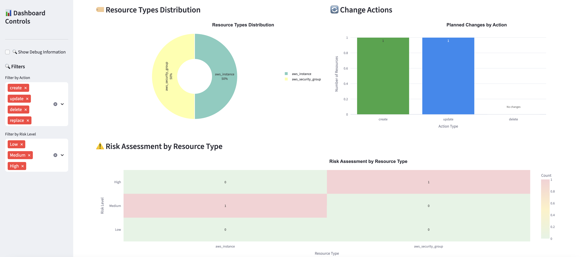

# 🚀 Terraform Plan Impact Dashboard

A comprehensive Streamlit-based dashboard for analyzing Terraform plan JSON files with advanced multi-cloud support, security analysis, and professional reporting capabilities.

## ✨ Key Features

- **☁️ Multi-Cloud Support**: AWS, Azure, GCP, and other provider detection and analysis
- **📊 Interactive Visualizations**: Plotly charts with resource distribution and risk analysis
- **🔒 Enhanced Security Analysis**: Provider-specific risk assessment and security recommendations
- **📄 Professional Reporting**: Template-based PDF/HTML generation with executive summaries
- **🏢 Enterprise Features**: Workflow-specific tours, accessibility compliance, and performance optimization
- **🔗 TFE Integration**: Direct connection to Terraform Cloud/Enterprise workspaces
- **🎯 User Experience**: Interactive onboarding, feature discovery, and comprehensive help system



## ⚠️ Disclaimer

**USE AT YOUR OWN RISK**. This tool is provided "as is", without warranty of any kind, express or implied. Neither the authors nor contributors shall be liable for any damages or consequences arising from the use of this tool. Always:

- 🧪 Test in a non-production environment first
- ✓ Verify results manually before taking action
- 💾 Maintain proper backups
- 🔒 Follow your organization's security policies
- 📜 Review the generated reports and analyses carefully
- 🔍 Understand the limitations of automated risk assessments
- 🔗 Ensure compliance with your cloud provider's best practices
- 📈 Monitor changes after applying Terraform plans

## 🚀 Quick Start

### 🚀 Installation

1. **Clone the repository:**

```bash
git clone <repository-url>
cd terraform-impact-dashboard
```

2. **Create and activate virtual environment:**

```bash
# Create virtual environment
python -m venv .venv

# Activate (Windows)
.venv\Scripts\activate

# Activate (macOS/Linux)
source .venv/bin/activate
```

3. **Install dependencies:**

```bash
pip install -r requirements.txt
```

4. **Run the dashboard:**

```bash
streamlit run app.py
```

The dashboard will open in your browser at `http://localhost:8501`

### 🎯 First Use

1. **Generate Sample Data**: Click "🔧 Generate Sample Plan Data" button and download the sample JSON file
2. **Upload Plan**: Drag & drop or browse for your JSON file (up to 200MB supported)
3. **Explore**: Review summary cards, interactive charts, and detailed resource information

## 📁 Project Structure

```
terraform-impact-dashboard/
├── app.py                           # Main Streamlit application
├── requirements.txt                 # Python dependencies
├── Pipfile                         # Pipenv dependency management
├── Pipfile.lock                    # Locked dependency versions
├── README.md                       # This documentation
├── components/                     # UI Components
│   ├── __init__.py                 # Component module initialization
│   ├── base_component.py           # Base component class
│   ├── header.py                   # Header and navigation
│   ├── sidebar.py                  # Sidebar controls
│   ├── upload_section.py           # File upload interface
│   ├── summary_cards.py            # Summary metrics display
│   ├── visualizations.py           # Chart components
│   ├── data_table.py              # Interactive data table
│   ├── enhanced_sections.py        # Enhanced feature sections
│   ├── help_system.py             # Comprehensive help system
│   ├── report_generator.py        # PDF/HTML report generation
│   ├── enhanced_pdf_generator.py   # Enhanced PDF generation engine
│   ├── security_analysis.py       # Security-focused analysis
│   └── onboarding_checklist.py    # User onboarding
├── parsers/
│   ├── __init__.py                 # Parser module initialization
│   └── plan_parser.py             # Terraform JSON parsing
├── visualizers/
│   ├── __init__.py                 # Visualizer module initialization
│   └── charts.py                  # Plotly chart generators
├── utils/
│   ├── __init__.py                 # Utils module initialization
│   ├── plan_processor.py          # Centralized plan data processing
│   ├── risk_assessment.py         # Basic risk scoring
│   ├── enhanced_risk_assessment.py # Advanced multi-cloud risk analysis
│   ├── security_analyzer.py       # Security analysis utilities
│   └── provider_factory.py        # Provider factory pattern
├── providers/
│   ├── __init__.py                 # Provider module initialization
│   ├── base_provider.py           # Base provider class
│   ├── cloud_detector.py          # Multi-cloud provider detection
│   ├── aws_provider.py            # AWS-specific provider logic
│   ├── azure_provider.py          # Azure-specific provider logic
│   ├── gcp_provider.py            # GCP-specific provider logic
│   └── standalone_tfe_client.py   # TFE integration client
├── config/
│   ├── __init__.py                 # Config module initialization
│   ├── provider_settings.py       # Provider configuration settings
│   └── risk_profiles.py           # Risk assessment profiles
├── ui/
│   ├── __init__.py                 # UI module initialization
│   ├── session_manager.py         # Session state management
│   ├── error_handler.py           # Error handling and user guidance
│   ├── progress_tracker.py        # Progress tracking
│   └── performance_optimizer.py   # Performance optimization
├── tests/                          # Comprehensive test suite
│   ├── __init__.py                 # Test module initialization
│   ├── README.md                   # Testing documentation
│   ├── unit/                       # Unit tests
│   ├── integration/                # Integration tests
│   ├── performance/                # Performance tests
│   └── fixtures/                   # Test fixtures and sample data
├── assets/
│   └── styles.css                 # Custom CSS styling
```

## 📊 Usage Guide

### 1️⃣ Generate Terraform Plan JSON

Create a JSON plan file from your Terraform configuration:

```bash
# Generate plan
terraform plan -out=tfplan

# Convert to JSON
terraform show -json tfplan > terraform-plan.json
```

### 2️⃣ Upload and Analyze

1. **Upload Plan**: Use the file uploader interface
2. **Review Summary**: Check summary cards for change counts and risk levels
3. **Explore Visualizations**: Interactive charts show resource distributions and patterns
4. **Use Data Table**: Filter, search, and examine detailed resource information
5. **Generate Reports**: Create professional PDF/HTML reports with multiple templates

## 🔗 TFE Integration

Connect directly to **Terraform Cloud/Enterprise** to analyze plans without manual downloads. Features automatic status detection, secure credential handling, and real-time plan analysis.

### 🚀 Quick Start

**Requirements:** TFE server URL, API token, organization name, workspace ID (`ws-*`), and run ID (`run-*`)

**YAML Configuration:**

```yaml
tfe_server: app.terraform.io
organization: my-org
token: your-api-token
workspace_id: ws-ABC123456
run_id: run-XYZ789012
verify_ssl: true # optional
```

**Usage:** Upload YAML config in the TFE tab → Automatic authentication and plan retrieval → Status feedback and analysis

### 📊 Status Detection

Automatically detects run/plan status: ✅ **Success** (Applied/Planned) • ⚠️ **Issues** (Errored/Canceled) • ℹ️ **In Progress** (Planning/Applying/Running)

> **💡 Tip**: Failed plans can still be analyzed to see planned changes before failure.

### 🔍 Finding IDs

**Workspace ID:** Found in workspace settings or URL path  
**Run ID:** Visible in run URL (`/runs/run-XXXXXXXXX`) or via TFE API

### 🔒 Security

Memory-only credential storage • Automatic cleanup • Encrypted communication • Session isolation • No data persistence

### 🔧 Troubleshooting

**Common Issues:** Invalid/expired tokens • Wrong workspace/run ID format • SSL certificate errors • Incomplete runs  
**Best Practices:** Use dedicated tokens • Enable SSL verification • Secure config storage • Test with recent runs

> **Need Help?** Use `convert_config.py` to migrate from JSON format, or check the dashboard's built-in configuration templates.

## 📄 Professional Reporting

The Enhanced PDF Generator creates professional reports using reportlab (pure Python, no system dependencies):

### Features:

- 🎨 **Multiple Templates**: Default, Executive, Technical, and Security-focused
- 📊 **Professional Styling**: Clean layouts with proper typography
- 📈 **Rich Content**: Executive summaries, risk analysis, detailed changes, and recommendations
- 🔧 **Template-Specific Titles**: Appropriate titles for each template type
- 📏 **Smart Sizing**: Automatic file size optimization

### Usage:

1. Select your preferred template
2. Choose report sections to include
3. Click "Generate Report" to create both HTML and PDF
4. Download with template-specific styling

## 🌟 Advanced Features

### ☁️ Multi-Cloud Support

- **Provider Detection**: Automatic identification of AWS, Azure, GCP, and other providers
- **Cross-Cloud Analysis**: Unified risk assessment across multiple cloud platforms
- **Provider-Specific Insights**: Tailored recommendations for each cloud provider
- **Resource Distribution**: Visual breakdown of resources across different clouds

### 🏢 Enterprise Features

- **Workflow-Specific Tours**: Guided tutorials for security reviews, production deployments
- **Enhanced Professional Reporting**: Template-based PDF/HTML generation with executive summaries, technical analysis, and security assessments
- **Accessibility Compliance**: Full WCAG 2.1 AA compliance with keyboard navigation
- **Performance Optimization**: Efficient handling of large Terraform plans (200MB+)
- **Interactive Onboarding**: Progressive checklist and contextual hints
- **Feature Discovery**: Smart suggestions based on usage patterns

## 🧪 Testing

Run the comprehensive test suite:

```bash
# Run all tests
python run_tests.py

# Run specific test categories
python -m pytest tests/unit/ -v
python -m pytest tests/integration/ -v

# Component-specific tests
python -m pytest tests/unit/test_components_basic.py -v
```

See `tests/README.md` for detailed testing documentation.

## 🔧 Troubleshooting

### ⚠️ Common Issues

**Streamlit command not found:**

```bash
python -m streamlit run app.py
```

**Import errors:**

```bash
# Ensure virtual environment is activated and reinstall dependencies
source .venv/bin/activate  # macOS/Linux
.venv\Scripts\activate     # Windows
pip install -r requirements.txt
```

**Large file upload issues:**

```bash
streamlit run app.py --server.maxUploadSize=200
```

**PDF generation issues:**

```bash
# Test enhanced PDF generator
python -c "from components.enhanced_pdf_generator import EnhancedPDFGenerator; print('Enhanced PDF generator working!')"

# Reinstall reportlab if needed
pip install reportlab
```

**Performance issues with large plans:**

- Enable debug mode to see processing details
- Use filters to focus analysis
- Large plans (>50MB) may take 30-60 seconds to process

## 🤝 Contributing

To extend the dashboard:

- Add new chart types in `visualizers/charts.py`
- Enhance risk logic in `utils/risk_assessment.py` or `utils/enhanced_risk_assessment.py`
- Add new parsers for different Terraform versions
- Improve styling in `assets/styles.css`
- Add new providers in `providers/` directory

## 🆘 Support

For issues or questions:

- **In-App Help**: Use the guided tour and contextual help system
- **Accessibility**: Full keyboard navigation and screen reader support
- **Feature Discovery**: Enable discovery mode for interactive feature hints
- **Debug Mode**: Enable in sidebar for detailed processing information

## 📄 License

This project is licensed under the MIT License - see the LICENSE file for details.
